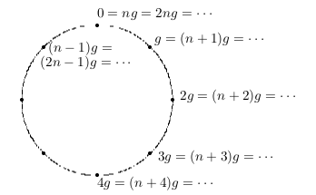

# Galois fields

This resource extracts every non-trivial result (basically everything) from [https://web.stanford.edu/~marykw/classes/CS250_W19/readings/Forney_Introduction_to_Finite_Fields.pdf] + provides some insights regarding non intuitive concepts (where possible).

### 7.2.2 $\mod n$ arithmetic

$r \equiv i \mod n$ 
$->$ 
$r = i + qn$ 
$---$ 
$s \equiv j \mod n$ 
$->$ 
$s = j + tn$ 
$---$ 
$->$ 
$r + s = i + j + (q + t)n$ 
$->$ 
$r + s \equiv i + j \mod n$ 
$->$ 
$r \oplus s = i + j$ 
$---$ 
$rs = ij + (qj + ti)n + qtn^{2}$ 
$->$ 
$rs \equiv ij \mod n$ 
$->$ 
$r \otimes s = ij$

### 7.3 Additive groups

The group operation $\oplus$ can be specified by an $n \times n$ table whose entries are of the form $a_i \oplus a_j$ (row $i$, column $j$). If $a_j \neq a_k$ then $a_i \oplus a_j \neq a_i \oplus a_k$ and this means that any elements in any row of the addition table are distinct, that is, each row contains each element of the group $G$ exactly once, and the same goes for the columns.

### 7.3.1 Alternative group axioms

The previously mentioned property of addition can be seen as a permutation of $G$, that is, each row of the table actually represents the set of the elements of $G$ in a different order. This property can be taken as one of the group axioms.

**Theorem 7.1** Let $G = \{ a, b, c, \dots \}$ be a set of elements on which the $\oplus$ operation is defined. Then $G$ is a group under the operation $\oplus$ if and only if:

- The operation is associative.
- There is an indentity element.
- For each $a \in G$, $a \oplus G$ is a permutation of $G$.

**Proof**. Basically we can derive the existence and uniqueness of inverses starting from the latter property, and also the algebraic closure, making the algebraic structure an additive group.

### 7.3.2 Cyclic groups

Of couse it's always possible to find a generator $g$ for additive groups.

$1g = g, 2g = g \oplus g, \dots, ig = g \oplus_{iTimes} g, \dots$

Since $g$ is a generator we must have $i \otimes g = 0$ for some $i$. Let $n$ be the smallest integer $n$ such that $n \otimes g = 0$ and $i \otimes g \neq 0$ for $1 \leq i \leq n - 1$. Adding $j \otimes g$ for any $j > 0$ to each side of $i \otimes g \neq 0$ results in $(i + j) \otimes g \neq j \otimes g$. Thus the elements $\\{ 1g, 2g, \dots, ng = 0 \\}$ must all be different. We can also add $j \otimes g$ to both sides of $n \otimes g = 0$, yielding $(j + n) \otimes g = j \otimes g$ for any $j > 0$. Thus, for each $i > n$, $i \otimes g$ is equal to some earlier element in the sequence, namely $(i - n) \otimes g$. The elements $\\{ 1g, 2g, \dots, ng = 0 \\}$ therefore constitute all of the distinct elements in $G$, and the order of $G$ is $|G| = n$. If we define $0g$ to be the identity, then we can represent the whole set as $G = \\{ 0g, 1g, \dots, (n - 1)g \\}$.

Note that in general when referring to a normal sum or product, the corresponding $\oplus, \otimes$ are implied under the hood. Also, this part is a little bit tricky but explains a really simple concept which I covered in a simplified manner at [https://github.com/Z323323/Group-theory-1/blob/main/README.md#additive-cyclic-groups] (even though here some more details are present). The image below shows the previous reasoning graphically.

It now results pretty clear that any $i$ can be written as $i = qn + r$ where $(r \equiv i \mod n) \in \\{ 0, 1, \dots, n - 1 \\}$. We also have $ig = (qn)g + rg \equiv rg \mod n$. The addition rule of $G$ is thus as follows: for each $0 \leq i, j < n$ we have $ig \oplus jg = [(i + j) \mod n] \otimes g$. Thus, any cyclic group of order $n$ is essentially identical to $Z_{n}$.

The correspondence $i \otimes g \in G \leftrightarrow i \in Z_{n}$ is preserved under addition, i.e. $ig \oplus jg \leftrightarrow i \oplus j$ for each $i, j \in Z_{n}$. This correspondence is called an _isomorphism_. Specifically, two finite groups $G$ and $H$ are _isomorphic_ if there exists an invertible function [ a function is called _invertible_ if for each $\beta \in H$ there is a unique $\alpha \in G$ such that $\beta = h(\alpha)$ ] $h: G \rightarrow H$ mapping each $\alpha \in G$ into a $\beta = h(\alpha) \in H$ such that $h(\alpha \oplus \alpha ') = h(\alpha) \oplus h(\alpha ')$, where $\oplus$ denotes the group operation of $G$ on the left and that of $H$ on the right.

Omomorphism, isomorphisms etc. are not easy concepts but they can become more familiar with some time. I delved both in the previous article linked, even though I can't say if it could be better to look at that resource.

**Theorem 7.2** The elements of a cyclic group $G$ of order $n$ with generator $g$ are $\\{ 0g, 1g, \dots, (n - 1)g \\}$. The addition rule is $ig \oplus jg = [(i + j) \mod n] \otimes g$, the identity is $0g$ and the inverse of $ig \neq 0g$ is $(n - i) \otimes g$ (because $i \otimes g + (n - i) \otimes g = (n - i + i) \otimes g = n \otimes g = 0$). Finally, $G$ is isomorphic to $Z_{n}$ under the $1:1$ correspondence $ig \leftrightarrow i$.

Since $Z_{n}$ is abelian, it follows that all cyclic groups are abelian.

In multiplicative notation, the elements of a cyclic group $G$ of order $n$ with generator $g$ are denoted by $\\{ g^{0} = 1, g^{1}, g^{2}, \dots, g^{n - 1} \\}$, the multiplication rule is $g^{i} \otimes g^{j} = g^{(i + j) \mod n}$, the identity is $g^{0} = 1$ and the inverse of $g^{i} \neq 1$ is $g^{n - i}$ (perhaps the easiest way to find an inverse, even though is computationally heavy).

For example if $\omega = e^{2\pi i / n}$, the set $\\{ 1, \omega, \omega^{2}, \dots, \omega^{n - 1} \\}$ of complex nth roots of unity is a cyclic group under complex multiplication, isomorphic to $Z_{n}$.

### 7.3.3 Subgroups

A subgroup $S$ of a group $G$ is an algebraic structure such that $S$ is itself a group and $S \subseteq G$. For any $g \in G$ (not necessarily generators for $G$) we define the coset (translate) $S \oplus g = \\{ s \oplus g | s \in S \\}$ (where $| =$ 'such that' in this case). We also have $S \oplus 0 = S$ and $S \oplus g = S$ iff $g \in S$.

This resource is probably not the best to really grasp subgroups (I think it's a little bit advanced), I strongly recommend to play around with [https://github.com/Z323323/Group-theory-elements/blob/main/Zn.py].

**Lemma 7.3** Two cosets $S \oplus g$ and $S \oplus h$ are the same if $g - h \in S$ or disjoint if $g - h \not\in S$.

**Proof**. If $g - h \in S$ then the elements of $S \oplus h$ include $(g - h) \oplus h = g$ and therefore all elements of $S \oplus g$ (remember that this means that we can represent the whole set as $\\{ (g - h) \oplus h = g \otimes 1, g \otimes 2, \dots, g \otimes n \\}$) so $S \oplus g \subseteq S \oplus h$. Also, since $g - h \in S$ then $n - g + h \in S$ and $\\{ (n - g + h) \oplus g = h \otimes 1, h \otimes 2, \dots, h \otimes n \\} = S$, thus $S \oplus h \subseteq S \oplus g$ and therefore $S \oplus g = S \oplus h$. 

Otherwise if $g - h \not\in S$, then $g - h \oplus h = g$ implies $g \not\in S$ and $n - g + h \oplus g$ implies $h \not\in S$; this means that $g$ doesn't share cofactors with $h$ and this means that the two subgroups are disjoint. This is clearer if you look at [https://github.com/Z323323/Group-theory-1/blob/main/README.md#additive-cyclic-groups].

It follows that the distinct cosets $S \oplus g$ and $S \oplus h$ of a subgroup $S \subseteq G$ form a disjoint partition of $G$, since every element $g \in G$ lies in some coset, namely $S \oplus g$.

The elements $s \oplus g$ of a coset $S \oplus g$ are all distinct, since $s \oplus g = s' \oplus g$ implies $s = s'$. Therefore if $S$ is finite then all cosets of $S$ have the same size, namely the size $|S|$ of $S = S \oplus 0$ (basically we can define $S$ cosets taking some $k \neq g$ which shares the same cofactors with $n$ and computing $S \oplus k | k \in S$; since $k$ and $g$ share the same cofactors with $n$ they produce a set which has order $|S|$). If $G$ is finite then is the disjoint union of a finite number $|C|$ of cosets of $S \subseteq G$, each of size $|S|$ (this doesn't mean they'll all have the same size, $|S|$ is a general form here), so $|G| = |C||S|$.

**Theorem 7.4 (Lagrange)** If $S$ is a subgroup of a finite group $G$, then $|S|$ divides $|G|$. This derives simply from the fact that the order of cosets depends on cofactors between the generators and the order $n$ of $G$ (not so easy for multiplicative groups though [https://github.com/Z323323/Group-theory-elements/tree/main?tab=readme-ov-file#lagranges-theorem]). Additive and multiplicative finite groups are more similar than what it might seem at first.

### 7.3.4 Cyclic subgroups

Let $g$ be some element of a group $G$; then $S(g) = \\{ g, g \oplus g, \dots \\}$ is a cyclic subgroup of $G$. We have $|S(m)| = n / gcd(n, m)$ (or $|S(m)| = lcm(n, m) / m$). We have $S(m) = Z_{n}$ iff $gcd(n, m) = 1$, that is, $n$ is prime, or $n$ and $m$ are coprime. We have $\phi(n)$ subgroups of order $n$. $\\{ 0 \\}$ is always of order $1$, and $\\{ 1 \\}$ of order $n$. In general, $Z_{n}$ has a cyclic subgroup $S_{d}$ of order $d$ for each integer $d$ that divides $n$, including $1$ and $n$. $S_{d} = \\{ 0, n / d, 2n / d, \dots, (d - 1)n / d \\}$ and is isomorphic to $Z_{d}$. $S_{d}$ contains $\phi(d)$ elements that are relatively prime to $d$, each of which has order $d$ and generates $S_{d}$. The remaining elements of $S_{d}$ belong also to smaller cyclic subgroups. This last two sentences are not the easiest to digest; to better explain them, the first one is because every element necessarily shares the same cofactors as the generator, thus taking those elements which don't share any other cofactor with $n$ (because they are coprime with $d$) we are basically taking elements of the same order of the generator; the second one is the opposite of the first, that is, numbers which share some other cofactor with $n$ will have necessarily a smaller order $(orderOfGenerator / furtherSharedCofactor(s))$. Since every element of $Z_{n}$ has some definite order $d$ that divides $n$, we have $n = \sum_{d | n} \phi(d)$. This last formula is not simple at all at first, I have a 'simple' proof of it at [https://github.com/Z323323/Number-theory-interlude-2?tab=readme-ov-file#sum_d--n-phid--n]. In this context I guess this formula can even be easier to get, since from the previous reasoning, for every divisor $d$ of $n$ we have $\phi(d)$ elements which have the same order, if we sum up all the $\phi(d)$ we end up having the number of elements of $Z_{n}$, that is, $n$. It's even less intuitive than this actually, because doing so we would get $n - 1$ not $n$, since the Totient function doesn't consider the $0$, but it's also true that we are considering only $n - 1$ numbers, and so we can safely add $\phi(0) = 1$ obtaining $n$.

### 7.4 Fields

A field is a set $F$ of at least two elements, with two operations $\oplus, \otimes$, for which the following axioms are satisfied:

- The set $F$ forms an abelian group under the operation $\oplus$ (identity: $0$).
- The set $F^{\star} = F - \\{ 0 \\} = \\{ a \in F, a \neq 0 \\}$ forms an abelian group (identity: $1$) under the operation $\otimes$.
- For all $a, b, c \in F, (a \oplus b) \otimes c = (a \otimes c) \oplus (b \otimes c)$ (distributive law).

### 7.4.1 Prime fields

A fundamental example of a finite (Galois) field is the set $F_{p}$ of $mod-p$ remainders, where $p$ is prime.

**Theorem 7.5** For every prime $p$, the set $R_{p} = \\{ 0, 1, \dots, p - 1 \\}$ forms a field $(F_{p})$ under $mod-p$ addition and multiplication.

**Proof**. The proof is quite trivial, since we just proved that $mod-p$ ops form an additive group. For the multiplicative group the proof is quite simple and I'm not going to rewrite it, feel free to read it at linked document from Stanford. I also wrote something related at [https://github.com/Z323323/From-Fermat-to-the-group-theory?tab=readme-ov-file#proof-of-existence-and-uniqueness-of-inverses-in-z_p-and-z_phinast]. That document contains every non-trivial detail needed.

One interesting detail we can spot from the Stanford proof is that for any $a \in F_{p}, \\{a \otimes 1, a \otimes 2, \dots, a \otimes (p - 1)\\}$ forms a permutation of $F_{p}$.

**Inner theorem** $F_{p}$ is the only field with $p$ elements, and all fields with $p$ elements are isomorphic.

**Proof**. Two fields $F$ and $G$ are isomorphic if there is an invertible function $h: F \rightarrow G$ mapping each $\alpha \in F$ into $\beta = h(\alpha) \in G$ such that $h(\alpha \oplus \alpha ') = h(\alpha) \oplus h(\alpha ')$ and $h(\alpha \otimes \alpha ') = h(\alpha) \otimes h(\alpha ')$. Less formally, $F$ and $G$ are isomorphic if there is a one-to-one correspondence $F \leftrightarrow G$ that translate the addition and multiplication tables of $F$ to those of $G$ and viceversa. 
Let $F$ be any field with a prime $p$ number of elements. By the field axioms, $F$ has an additive identity $0$ and multiplicative identity $1$. Consider the additive cyclic subgroup generated by $1, S(1) = \\{ 1, 1 \oplus 1, \dots \\}$. By Lagrange's theorem, the order of $S(1)$ divides $|F| = p$, indeed it's trivially $p$, this means that $S(1) = F$, and the additive group is isomorphic to $Z_{p}$, thus we may denote $F$ by $(\\{ 0, 1, 2, \dots, p - 1 \\}, + \mod p, \star \mod p)$. The only remaining question is whether this correspondence $F \leftrightarrow Z_{p}$ under addition extends to multiplication (this is the main problem). The distributive law shows that it does: $j \otimes i$ is the sum of $j$ terms each equal to $i$, so $j \otimes i = (ji \mod p)$.

**Theorem 7.6** Every field $F$ with a prime number $p$ of elements is isomorphic to $F_{p}$ via the correspondence $1 \oplus \dots \oplus 1 \in F \leftrightarrow i \in F_{p}$.

In view of this elementary isomorphism, we will denote any field with a prime number $p$ elements by $F_{p}$. It's important to note that $Z_{n}$ does not form a field if $n$ is not prime. This is because $n = ab$ implies $ab \equiv 0 \mod n$, so the set of nonzero elements of $Z_{n}$ is not closed under multiplication mod $n$. Nonetheless we will see that there do exist finite fields with non-prime numbers of elements that use other rules for addition and multiplication (this is the main purpose of Galois fields). Homomorphisms and isomorpisms are really abstract concepts, I'll provide further analysis if required, but for the moment let's go over.

### 7.4.2 The prime subfield of a finite field

A subfield $G$ of a field $F$ is a subset of the field that is itself a field under the operations of $F$. Every finite field $F_{q}$ has a subfield that is isomorphic to a prime field $F_{p}$. Let $F_{q}$ be a finite field with $q$ elements; by the field axioms, $F_{q}$ has an additive identity $0$ and a multiplicative identity $1$. Consider now the cyclic subgroup of the additive group of $F_{q}$ that is generated by $1, S(1) = \\{ 1, 1 \oplus 1, \dots \\}$. We have $n = |S(1)|$. $S(1)$ is isomorphic to $Z_{n}^{+} = (\\{ 1, 2, \dots, n - 1 \\}, + \mod n)$. By the distributive law in $F_{q}$, $i \otimes j$ (in $F_{q}$) of two nonzero elements in $S(1)$ is simply the sum of $ij$ $1s$, which is an element of $S(1)$, namely $ij \mod n$. Since this is a product of nonzero elements of $F_{q}$ $ij \mod n$ must be non zero for every nonzero $i, j$. This will be true iff $n$ is prime.

Thus $S(1)$ forms a subfield of $F_{q}$ with a prime number $p$ of elements. By the prime field theorem of the previous subesection, $S(1)$ is isomorphic to $F_{p}$. Thus the elements of $S(1)$, which are called the integers of $F_{q}$, may be denoted by $F_{p} = \\{ 0, 1, dots, p - 1 \\}$ and the addition and multiplication rules of $F_{q}$ reduce to $mod-p$ addition and multiplication in $F_{p}$.

The prime $p$ is called **characteristic** of $F_{p}$. Since the $p-fold$ sum of the identity $1$ with itself is $0$, the $p-fold$ sum of every field element $\beta \in F_{p}$ with itself is $0$: $p\beta = 0$.

**Theorem 7.7** The integers $\\{ 1, 1 \oplus 1, \dots \\}$ of any finite field $F_{q}$ form a subfield $F_{p} \subseteq F_{q}$ with a prime number $p$ of elements, where $p$ is the characteristic of $F_{q}$.

This section is mainly a bunch of formalisms to show that is possible to define a subfield using the element $1$ as generator to produce the additive subgroup, and use the isomorphism rules to show that the generated group is a fine multiplicative group (or something like that lol). I don't think this section will be of outmost importance along the way. The actual magic is to understand how to create fields of $p^{m}$ elements, and the next sections are what really matters.

Before going over, let me spend a couple words about the primality constraint of $n$.
1. If we need to define a field, we will necessarily need $1$ in the set (identity of multiplication).
2. If we have a $1$ in the set, $1$ will be a generator for $Z_{n}^{+}$, or, in other words, the presence of $1$ in the field set force the field set to be $\\{ 0, 1, 2, 3, \dots, n - 1 \\}$, because there are no constraints in the usage of the binary operations (here we only need consider $\oplus$).
3. [2.] implies that if $n$ is not prime then $a, b \in Z_{n} | n = ab$ implies $ab \equiv 0 \mod n$, so the set of nonzero elements of $Z_{n}$ is not closed under multiplication mod $n$.

Therefore the only way to have a field is to have a prime $n$. The reasoning changes with polynomials.

### 7.5 Polynomials

Let's now consider polynomials over $F_{p}$, namely polynomials whose coefficients lie in $F_{p}$ and for which polynomial addition and multiplication is performed in $F_{p}$. A nonzero polynomial $f(x)$ of degree $m$ over a field $F$ is an expression of the form

$f(x) = f_{0} + f_{1}x + f_{2}x^{2} + \dots + f_{m}x^{m}$

where $f_{i} \in F, 0 \leq i \leq m$ and $f_{m} \neq 0$. We have $deg(f(x)) = m$. The symbol $x$ represents an indeterminate, not an element of $F$, i.e., two polynomials are different if and only if their coefficients are different. [ Over the real field $R$, a polynomial $f(x)$ is sometimes regarded as a function $f: R \rightarrow R$ and two polynomials over $R$ are different iff the corresponding polynomial functions are different. However, over finite fields it's not, i.e. over $F_{2}$ the polynomial functions $x$ and $x^{2}$ both map $0 \rightarrow 0, 1 \rightarrow 1$, yet $x$ and $x^{2}$ are different. ] The nonzero polynomials of degree $0$ are simply the nonzero field elements $f_{0} \in F$. There's also a special _zero polynomial_ $f(x) = 0$ whose degree is defined by convention as $deg(0) = - \infty$. The set of all polynomials over $F$ in an indeterminate $x$ is denoted by $F[x]$.

The rules for adding, subtracting or multiplying polynomials are the same over a general field $F$ over $R$, except that coefficient operations are in $F$. In particular, addition and subtraction are performed componentwise (we can't add two different-degree indeterminates). For multiplication, the coefficients of a polynomial product $f(x) = h(x)g(x)$ are determined by _convolution_ (I guess $i \geq j$ is implied, even though in general I guess we'll have $i = j$ but I could be wrong):

$f_{i} = \sum_{j = 0}^{i} h_{j}g_{i - j}$

Let's get the arcane magic behind convolution.

$----$

### Convolution deep dive

$h(x) = \sum_{i = 0}^{n} a_{i}x^{i}$ 
$g(x) = \sum_{j = 0}^{m} b_{j}x^{j}$ 
$->$ 
$h(x)g(x) = \sum_{i = 0}^{n}\sum_{j = 0}^{m} a_{i}b_{j}x^{i}x^{j}$ 
$->$ 
$k = i + j$ 
$->$ 
$\sum_{i = 0}^{n}\sum_{j = 0}^{m} a_{i}b_{j}x^{k}$ 
$-artifice>$ 
$z = n + m$ 
$->$ 
$h(x)g(x) = \sum_{i = 0}^{z} \sum_{j = 0}^{i} a_{j}b_{i - j} x^{i}$ 
$-renamingVars + excludingX + extractingFx>$ 
$[[ f_{i} = \sum_{j = 0}^{i} h_{j}g_{i - j} ]]$ 
$-restoringPrev + addingMoreControl + keepingXOut>$ 
Note that the following formula (should) hold only for $m \leq n$, otherwise the floor function will produce inconsistent results.
$h(x)g(x) = \sum_{i = 0}^{z} \sum_{j = 0}^{j \leq i (\mod n + 1)} h_{j + (i \mod n)\lfloor i / (n + 1) \rfloor}g_{(i - j) - (i \mod n)\lfloor i / (n + 1) \rfloor}$ 
$->$ 
$f_{0} = h_{0}g_{0}$ 
$f_{1} = h_{0}g_{1} + h_{1}g_{0}$ 
$f_{2} = h_{0}g_{2} + h_{1}g_{1} + h_{2}g_{0}$ 
$f_{3} = h_{0}g_{3} + h_{1}g_{2} + h_{2}g_{1} + h_{3}g_{0}$ 
$f_{4} = h_{0}g_{4} + h_{1}g_{3} + h_{2}g_{2} + h_{3}g_{1} + h_{4}g_{0}$ 
$f_{5} = h_{0}g_{5} + h_{1}g_{4} + h_{2}g_{3} + h_{3}g_{2} + h_{4}g_{1} + h_{5}g_{0}$ 
$\dots$ 
Assuming $n = m$ for clarity. 
$f_{n} = h_{0}g_{n} + h_{1}g_{n - 1} + h_{2}g_{n - 2} + \dots + h_{n - 2}g_{2} + h_{n - 1}g_{1} + h_{n}g_{0}$ 
$f_{n + 1} = h_{1}g_{n} + h_{2}g_{n - 1} + h_{3}g_{n - 2} + \dots + h_{n - 1}g_{2} + h_{n}g_{1}$ 
$f_{n + 2} = h_{2}g_{n} + h_{3}g_{n - 1} + h_{4}g_{n - 2} + \dots + h_{n}g_{2}$ 
$\dots$ 
Note $z$ should be at most $2n$ (assuming $z = 2n$ here). 
$f_{z - 5} = h_{n - 5}g_{n} + h_{n - 4}g_{n - 1} + h_{n - 3}g_{n - 2} + h_{n - 2}g_{n - 3} + h_{n - 1}g_{n - 4} + h_{n}g_{n - 5}$ 
$f_{z - 4} = h_{n - 4}g_{n} + h_{n - 3}g_{n - 1} + h_{n - 2}g_{n - 2} + h_{n - 1}g_{n - 3} + h_{n}g_{k - 4}$ 
$f_{z - 3} = h_{n - 3}g_{n} + h_{n - 2}g_{n - 1} + h_{n - 1}g_{n - 2} + h_{n}g_{n - 3}$ 
$f_{z - 2} = h_{n - 2}g_{n} + h_{n - 1}g_{n - 1} + h_{n}g_{n - 2}$ 
$f_{z - 1} = h_{n - 1}g_{n} + h_{n}g_{n - 1}$ 
$f_{z} = h_{n}g_{n}$

$----$

If two nonzero polynomials are multiplied, then their degrees add; i.e., $deg(h(x)g(x)) = deg(h(x)) + deg(g(x))$. The document reports _"The convention_ $deg(0) = - \infty$ _ensures that this formula continues to hold when_ $h(x)$ _or_ $g(x)$ _is the zero polynomial."_.

The set $F[x]$ has many of the properties of a field. It's an abelian group under addition, whose identity is the zero polynomial $0 \in F[x]$. It is closed under multiplication, which is both associative and commutative and which distributes over addition. It has a multiplicative identity $1 \in F[x]$ and the cancellation law holds.

All of these properties should be evident from the previous structure; for all values ranging from $f_{n + 1}$ to $f_{z}$ what will probably happen is that all of those will be folded into the first "half" (assuming a modulo operation which is capped at $x^{n}$) because the relative $x$ values will range from  $x^{n + 1} = x$ to $x^{z - 1}$ which (assuming $z = 2n$) equals $x^{2n - 1} = x^{n - 1}$, and $x^{z} = x^{2n} = x^{0} = 1$. Note these are just hypotheses by the way, because we still haven't explored modulo operations involving polynomials.

In general we cannot divide evenly by a nonzero polynomial, since a polynomial $f(x)$ with $deg(f(x)) > 0$ has no multiplicative inverse, therefore $F[x]$ is a ring [ rings don't have inverses, while they are the same regarding other properties ], not a field. We now develop a series of properties of $F[x]$ that resemble those of $Z$.

### 7.5.1 Definitions

A polynomial is said to be a divisor of a polynomial $f(x)$ if $f(x)$ is a polynomial multiple of $g(x)$, that is, $f(x) = q(x)g(x)$ for some polynomial $q(x)$. Thus, all polynomials are trivially divisors of the zero polynomial. Polynomials which have polynomials inverses are the nonzero degree-0 polynomials $\beta \in F^{\star} = F - \\{ 0 \\}$. These are called units of $F[x]$. If $u(x)$ is a unit polynomial and $g(x)$ is a divisor of $f(x)$, then $u(x)g(x)$ is a divisor of $f(x)$ and $g(x)$ is a divisor of $u(x)f(x)$. Thus, the factorization of a polynomial can be unique only up to a unit polynomial $u(x)$, and $u(x)f(x)$ has the same divisors as $f(x)$. 

A _monic polynomial_ is a nonzero polynomial $f(x)$ of degree $m$ with high-order coefficient $f_{m}$ equal to $1$, i.e. $f(x) = f_{0} + f_{1}x + f_{2}x^{2} + \dots + x^{m}$. Every nonzero polynomial $g(x)$ may be written as the product $g(x) = g_{m}f(x)$ of a monic polynomial $f(x)$ of the same degree with a unit polynomial $u(x) = g_{m}$, and the product of two monic polynomials is monic. We may therefore consider only factorizations of monic polynomials into products of monic polynomials.

Every nonzero polynomial $f(x)$ is divisible by $1$ and $f(x)$; these divisors are called trivial. A polynomial $g(x)$ is said to be a factor of a polynomial $f(x)$ if $g(x)$ is monic and a nontrivial divisor of $f(x)$. Thus the degree of any factor $g(x)$ of $f(x)$ satisfies $1 \leq deg(g(x)) \leq deg(f(x))$.

A polynomial $g(x)$ of degree $1$ or more that has no factors is called an _irreducible polynomial_, and a monic irreducible polynomial is called a _prime polynomial_. Now we are going to show that every monic polynomial has a unique factorization into prime polynomials factors.

### 7.5.2 $\mod g(x)$ arithmetic

Given a monic polynomial $g(x)$ of degree $m$, every polynomial $f(x)$ may be expressed as $f(x) = q(x)g(x) + r(x)$ for some polynomial remainder $r(x)$ such that $deg(r(x)) < m$ and some polynomial quotient $q(x)$. This may be proved by the Euclidean long division algorithm, with component operations in $F$. The resulting quotient $q(x)$ and remainder $r(x)$ are unique. The remainder polynomial $r(x)$ is denoted by $f(x) \equiv r(x) \mod g(x)$. The set of all possible remainder polynomials is the set $R_{F, m} = \\{ r_{0} + r_{1}x + \dots + r_{m - 1}x^{m - 1} | r_{j} \in F, 0 \leq j \leq m - 1 \\}$ whose size is $|R_{F, m}| = |F|^{m}$. Evidently $g(x)$ is a divisor of $f(x)$ if and only if $f(x) \mod g(x) = 0$. Remainder arithmetic using the remainder set $R_{F, m}$ is called $\mod g(x)$-arithmetic. The rules for $\mod g(x)$-arithmetic follow from the rules for polynomial arithmetic as follows.

Let $r(x) = f(x) \mod g(x)$ and $s(x) = h(x) \mod g(x)$; then, as polynomials, $r(x) = f(x) - q(x)g(x)$ and $s(x) = h(x) - t(x)g(x)$ for some quotient polynomials $q(x)$ and $t(x)$. Then

$f(x) + h(x) = r(x) + s(x) + (q(x) + t(x))g(x)$ 
$->$ 
$f(x) + h(x) \equiv r(x) + s(x) \mod g(x)$ 
$->$ 
$f(x) \oplus h(x) = r(x) + s(x)$ 
$and$ 
$f(x)h(x) = (r(x) + q(x)g(x))(s(x) + t(x)g(x)) = r(x)s(x) + (q(x)s(x) + t(x)r(x))g(x) + q(x)t(x)g^{2}(x)$ 
$->$ 
$f(x)h(x) \equiv r(x)s(x) \mod g(x)$ 
$->$ 
$f(x) \otimes h(x) = r(x)s(x)$

### 7.5.3 Unique factorization

Every monic polynomial is either irreducible or can be factored into a product of monic polynomial factors, each of lower degree (this fact can be easily checked by looking at the convolution dissection I provided above, tip: $f_{z} = h_{n}g_{n}$). In turn, if a factor is not irreducible, it can be factored further (ez). Since factor degrees are decreasing but bounded below by $1$, we must eventually arrive at a product of monic irreducible prime polynomials. The following theorem shows that there is only one such set of prime polynomial factors, regardless of the order in which the polynomial is factored.

**Theorem 7.8 (Unique factorization of polynomials)** Over any field $F$, every monic polynomial $f(x) \in F[x]$ of degree $m \geq 1$ may be written in the form

$f(x) = \prod_{i = 1}^{k} a_{i}(x)$

where each $a_{i}(x), 1 \leq i \leq k$, is a prime polynomial in $F[x]$. This factorization is unique, up to the order of the factors (note that $a_{i}(x) \neq a_{i}x$ in this context).

**Proof**. We have already shown that $f(x)$ may be factored in this way, so we need only prove uniqueness. Assume hypothetically that the theorem is false and let $m$ be the smallest degree such that there exists a $degree-m$ monic polynomial $f(x)$ with more than one such factorization

$f(x) = a_{1}(x) \dots a_{k}(x) = b_{1}(x) \dots b_{j}(x)$ and $j, k \geq 1$

where $a_{1}(x), \dots, a_{k}(x)$ and $b_{1}(x), \dots, b_{j}(x)$ are prime polynomials. We are going to show that this implies a polynomial $f'(x)$ with degree less than $m$ with non-unique factorization, and this contradiction will prove the theorem.

We can see that $a_{1}(x)$ cannot appear on the right side of the previous formula, else it could be factored out for an immediate contradiction. Similarly, $b_{1}(x)$ cannot appear on the left. Now, assume $deg(b_{1}(x)) \leq deg(a_{1}(x))$. By the Euclidean division algorithm, $a_{1}(x) = q(x)b_{1}(x) + r(x)$. This last formula could seem like a contradiction since we just said that $b_{1}(x)$ cannot appear on the left, but here it actually won't appear left because the value of $a_{1}(x)$ is not $b_{1}(x)$ but $q(x)b_{1}(x) + r(x)$ which solved doesn't equal $b_{1}(x)$ and we can't even factor $b_{1}(x)$ because of remainder. This is a tricky math trick, we can represent any polynomial using the form $h(x)g(x) + r(x)$, now if $deg(a_{1}(x)) = deg(b_{1}(x))$ then we will have for example $deg(h(x)) > deg(g(x))$ or $g(x)$ won't even exist, of course we can interchange this for $h(x)$ or $g(x)$ since the commutative property. Now, since $a_{1}(x)$ is irreducible, $r(x) \neq 0$ and $0 \leq deg(r(x)) < deg(b_{1}(x)) \leq deg(a_{1}(x))$. Thus, $r(x)$ has a prime factorization $r(x) = \beta r_{1}(x)\dots r_{n}(x)$, where $\beta$ is the high-order coefficient of $r(x)$ and $b_{1}(x)$ is not a divisor of any of the $r_{1}(x)$, since it has greater degree. Substituting into the previous formula we obtain

$(q(x)b_{1}(x) + \beta r_{1}(x) \dots r_{n}(x))a_{2}(x) \dots a_{k}(x) = b_{1}(x) \dots b_{j}(x)$ 
$->$ 
$q(x)b_{1}(x)a_{2}(x) \dots a_{k}(x) + \beta r_{1}(x) \dots r_{n}(x)a_{2}(x) \dots a_{k}(x) = b_{1}(x) \dots b_{j}(x)$ 
$->$ 
$\beta r_{1}(x) \dots r_{n}(x)a_{2}(x) \dots a_{k}(x) = b_{1}(x) \dots b_{j}(x) - q(x)b_{1}(x)a_{2}(x) \dots a_{k}(x)$ 
$->$ 
$r_{1}(x) \dots r_{n}(x)a_{2}(x) \dots a_{k}(x) = \beta^{- 1}(b_{1}(x) \dots b_{j}(x) - q(x)b_{1}(x)a_{2}(x) \dots a_{k}(x))$ 
$->$ 
$r_{1}(x) \dots r_{n}(x)a_{2}(x) \dots a_{k}(x) = \beta^{- 1}b_{1}(x)(b_{2}(x) \dots b_{j}(x) - q(x)a_{2}(x) \dots a_{k}(x))$ 
$->$ 
$f'(x) = r_{1}(x) \dots r_{n}(x)a_{2}(x) \dots a_{k}(x) = \beta^{- 1}b_{1}(x)(b_{2}(x) \dots b_{j}(x) - q(x)a_{2}(x) \dots a_{k}(x))$

Now, $f'(x)$ is monic, because it is a product of monic polynomials; it has degree less than $f(x)$, since $deg(r(x)) < deg(a_{1}(x))$ [ this is because at the right we have $b_{1}(x)q(x)$ which has the same degree of $a_{1}(x)$ and $deg(b_{2}(x) \dots b_{j}(x)) < deg(q(x)a_{2}(x) \dots a_{k}(x))$ ] and it has two different factorizations, with $b_{1}(x)$ a factor in one but not a divisor of any of the factors in the other, a contradiction.

### 7.5.4 Enumerating prime polynomials

The prime polynomials in $F[x]$ are analogous to the prime numbers in $Z$. One way to enumerate the prime polynomials is to use an analogue of the sieve of Eratosthenes. For integers, this method goes as follows: Start with a list of all integers greater than $1$. The first integer on the list is $2$, which is prime. Erase all multiples of $2$. The next remaining integer is $3$ which must be the next prime: Erase all multiples of $3$. The next remaining integer is $5$ which is prime: Repeat the process to get all primes.

Similarly, to find the prime polynomials in $F_{2}[x]$ for example, first list all polynomials of degree $1$ or more in $F_{2}[x]$ in order of degree. (All nonzero polynomials in $F_{2}[x]$ are monic.) No degree-1 polynomial can have a factor, so the two degree-1 polynomials $x$ and $x + 1$ are both prime. Next, erase all degree-2 multiples of $x$ and $x + 1$, namely

$x^{2} = xx$ 
$x^{2} + x = x(x + 1)$ 
$x^{2} + 1 = (x + 1)(x + 1)$ 

from the list of degree-2 polynomials. This leaves one prime degree-2 polynomial, namely $x^{2} + x + 1$. Next, erase all degree-3 multiples of $x, x + 1$ and $x^{2} + x + 1$ from the list eight degree-3 polynomials, namely the six polynomials

$x^{3} = xxx$ 
$x^{3} + x^{2} = (x + 1)xx$ 
$x^{3} + x = (x + 1)(x + 1)x$ 
$x^{3} + x^{2} + x = x(x^{2} + x + 1)$ 
$x^{3} + 1 = (x + 1)(x^{2} + x + 1)$ 
$x^{3} + x^{2} + x + 1 = (x + 1)(x + 1)(x + 1)$

The remaining polynomials are $x^{3} + x^{2} + 1$ and $x^{3} + x + 1$ must therefore be prime. Continuing this way, we may list all prime polynomials in $F_{2}[x]$ up to any desired degree.

It turns out that the number $N(m)$ of prime polynomials of $F_{2}[x]$ of degree $m$ is $N(m) = 2, 1, 2, 3, 6, 9, 18, 30, 56, 99, \dots$ for $m = 1, 2, 3, 4, 5, 6, 7, 8, 9, 10, \dots$. A similar sieve algorithm may be used to find the prime polynomials in $F[x]$ over any finite field $F$. The algorithm with a listing of the monic polynomials ordered by degree, and successively erases the multiples of lower degree prime polynomials.

### 7.6 A construction of a field with $p^{m}$ elements

We now show how to construct a field with $p^{m}$ elements for any prime integer $p$ and positive integer $m \geq 1$. Its elements will be the set $R_{F, m}$ of remainder polynomials of degrees less than $m$, and multiplication will be defined modulo an irreducible polynomial $g(x)$ of degree $m$. We will subsequently show that every finite field is isomorphic to a finite field that is constructed in this way.

The construction assumes the existence of a prime polynomial $g(x) \in F_{p}[x]$ of degree $m$. The proof that such a polynomial exists for all prime $p$ and $m \geq 1$ will be deferred until later. The field that we construct will be denoted by $F_{g(x)}$. 

The set of elements of $F_{g(x)}$ will be taken to be the $\mod g(x)$ remainder set 

$R_{F_{p, m}} = \\{ r_{0} + r_{1}x + \dots + r_{m - 1}x^{m - 1} | r_{j} \in F_{p}, 0 \leq j \leq m - 1 \\}$

whose size is $|R_{F_{p}, m}| = p^{m}$.

If you have a computer science background, it's quite simple to figure out that such structure allows to represent $2^{m}$ values, that is, $2^{m} - 1 + \\{ 0 \\} = 2^{m}$. What about other prime numbers then? Let's see an example using $5$ which will clarify the reasoning for any prime.

**Ex. $p = 5, m = 2$**

$R_{F_{5, 2}} = \\{ r_{0} + r_{1}x | r_{j} \in F_{5}, 0 \leq j \leq m - 1 \\}$ 
$->$ 
We set $x = 5$ 
$->$ 
$R_{F_{5, 2}} = \\{ 0 + 0(5) \\} = 0$ 
$R_{F_{5, 2}} = \\{ 1 + 0(5) \\} = 1$ 
$R_{F_{5, 2}} = \\{ 2 + 0(5) \\} = 2$ 
$R_{F_{5, 2}} = \\{ 3 + 0(5) \\} = 3$ 
$R_{F_{5, 2}} = \\{ 4 + 0(5) \\} = 4$ 
$R_{F_{5, 2}} = \\{ 0 + 1(5) \\} = 5$ 
$R_{F_{5, 2}} = \\{ 1 + 1(5) \\} = 6$ 
$R_{F_{5, 2}} = \\{ 2 + 1(5) \\} = 7$ 
$R_{F_{5, 2}} = \\{ 3 + 1(5) \\} = 8$ 
$R_{F_{5, 2}} = \\{ 4 + 1(5) \\} = 9$ 
$R_{F_{5, 2}} = \\{ 0 + 2(5) \\} = 10$ 
$R_{F_{5, 2}} = \\{ 1 + 2(5) \\} = 11$ 
$R_{F_{5, 2}} = \\{ 2 + 2(5) \\} = 12$ 
$R_{F_{5, 2}} = \\{ 3 + 2(5) \\} = 13$ 
$R_{F_{5, 2}} = \\{ 4 + 0(5) \\} = 14$ 
$R_{F_{5, 2}} = \\{ 0 + 3(5) \\} = 15$ 
$R_{F_{5, 2}} = \\{ 1 + 3(5) \\} = 16$ 
$R_{F_{5, 2}} = \\{ 2 + 3(5) \\} = 17$ 
$R_{F_{5, 2}} = \\{ 3 + 3(5) \\} = 18$ 
$R_{F_{5, 2}} = \\{ 4 + 3(5) \\} = 19$ 
$R_{F_{5, 2}} = \\{ 0 + 4(5) \\} = 20$ 
$R_{F_{5, 2}} = \\{ 1 + 4(5) \\} = 21$ 
$R_{F_{5, 2}} = \\{ 2 + 4(5) \\} = 22$ 
$R_{F_{5, 2}} = \\{ 3 + 4(5) \\} = 23$ 
$R_{F_{5, 2}} = \\{ 4 + 4(5) \\} = 24$ 
$->$ 
$|R_{F_{5, 2}}| = 5^{2} = 25$.

$----$

It's quite simple now to figure out that this structure works for any prime, and any power. It's also quite simple to figure out that field axioms are satisfied by such structure. It's also important to note that our polynomial structure won't follow this structured order but will just allows to build a structure which is isomorphic to a structure which has the form shown by example above.

**Theorem 7.9** If $g(x)$ is a prime polynomial of degree $m$ over a prime field $F_{p}$, then the set of remainder polynomials $R_{F_{p, m}}$ with $\mod g(x)$ arithmetic forms a finite field $F_{g(x)}$ with $p^{m}$ elements.

**Example 1 (Provided by the document)** Let us construct a finite field with $2^{2} = 4$ elements using the prime degree-2 polynomial $g(x) = x^{2} + x + 1 \in F_{2}[x]$.

There are four remainder polynomails $\mod x^{2} + x + 1$, namely $\\{ 0, 1, x, x + 1 \\}$. To actually get why the following arcane structures hold, you should know a little bit about polynomials (finite) long division, but for what concerns $F_{2}[x]$ you should figure out the behaviour quite easily. The structures produced for addition and multiplication follow the tables below.

<table>
  <tr>
    <th scope="col">+</th>
    <th scope="col">0</th>
    <th scope="col">1</th>
    <th scope="col">x</th>
    <th scope="col">x + 1</th>
  </tr>
  <tr>
    <th scope="row">0</th>
    <td>0</td>
    <td>1</td>
    <td>x</td>
    <td>x + 1</td>
  </tr>
  <tr>
    <th scope="row">1</th>
    <td>1</td>
    <td>0</td>
    <td>x + 1</td>
    <td>x</td>
  </tr>
  <tr>
    <th scope="row">x</th>
    <td>x</td>
    <td>x + 1</td>
    <td>0</td></td>
    <td>1</td>
  </tr>
  <tr>
    <th scope="row">x + 1</th>
    <td>x + 1</td>
    <td>x</td>
    <td>1</td>
    <td>0</td>
  </tr>
</table>

<table>
  <tr>
    <th scope="col">×</th>
    <th scope="col">0</th>
    <th scope="col">1</th>
    <th scope="col">x</th>
    <th scope="col">x + 1</th>
  </tr>
  <tr>
    <th scope="row">0</th>
    <td>0</td>
    <td>0</td>
    <td>0</td>
    <td>0</td>
  </tr>
  <tr>
    <th scope="row">1</th>
    <td>0</td>
    <td>1</td>
    <td>x</td>
    <td>x + 1</td>
  </tr>
  <tr>
    <th scope="row">x</th>
    <td>0</td>
    <td>x</td>
    <td>x + 1</td></td>
    <td>1</td>
  </tr>
  <tr>
    <th scope="row">x + 1</th>
    <td>0</td>
    <td>x + 1</td>
    <td>1</td>
    <td>x</td>
  </tr>
</table>

A couple results for the second table are less intuitive and so let's see the actual process below.

$XX = X^{2}$ 
$->$ 
$\displaystyle \frac{X^{2}}{X^{2} + X + 1} = 1 - \frac{X + 1}{X^{2} + X + 1}$

It's easier now to figure out that the remainder is $X + 1$, the same goes for other less intuitive ops like

$(X + 1)X = X^{2} + X$ 
$->$ 
$\displaystyle \frac{X^{2} + X}{X^{2} + X + 1} = 1 - \frac{1}{X^{2} + X + 1}$

Polynomial remainder is not the most intuitive thing as you can see.

### 7.7 $F_{q}^{\star}$ is cyclic

It's quite simple now to figure out that $F_{q}^{\star}$ of $q - 1$ elements is a finite abelian group under multiplication. Let's see some cyclicality related theorems and behaviours (it's also already simple to figure out that this group is cyclic too by the way, I'm following this for completeness purposes and because there could be some important results).

Every element of $F_{q}^{\star}$ is a root of the polynomial $x^{q - 1} - 1 \in F_{q}[x]$. This is simple too, that is, it follows from the Fermat's little theorem

$x^{q - 1} \equiv 1 \mod p$ 
$->$ 
$x^{q - 1} - 1 = 0$ 
$--extra--$ 
$-LagrangeInterpolation>$ 
$(x - 1)(x - 2)\dots (x - (q - 1)) = x^{q - 1} - 1$

### 7.7.1 Roots of polynomials

Let $F[x]$ be the set of polynomials over an arbitrary field $F$. If $f(x) \in F[x]$ has a degree-1 factor $x - \alpha$ for some $\alpha \in F$, then $\alpha$ is called a _root_ of $f(x)$.

Since any $f(x)$ can be uniquely expressed as $f(x) = q(x)(x - \alpha) + \beta$ for some quotient $q(x)$ and some $\beta \in F$ (for some remainder $r(x) = \beta$ of degree less than 1), it follows that $f(\alpha) = \beta$. Therefore $\alpha$ is a root of $f(x)$ if and only if $f(\alpha) = 0$, that is, if $\alpha$ is a root of the polynomial equation $f(x) = 0$.

By degree additivity, the degree of a polynomial $f(x)$ is equal to the sum of the degrees of its prime factors, which are unique by unique factorization. Therefore a polynomial of degree $m$ can have at most $m$ degree-1 factors. This yields what is sometimes called the fundamental theorem of algebra.

**Theorem 7.10 (Fundamental theorem of algebra)** Over any field $F$, a monic polynomial $f(x) \in F(x)$ of degree $m$ can have no more than $m$ roots in $F$. If it does have $m$ roots $\\{ \beta_{1}, \dots, \beta_{m} \\}$ then the unique factorization of $f(x)$ is $f(x) = (x - \beta_{1}) \dots (x - \beta_{m})$.

Since the polynomial $x^{n} - 1$ can have at most $n$ roots in $F$, we have an important corollary:

**Theorem 7.11 (Cyclic multiplicative subgroups)** In any field $F$, the multiplicative group $F^{\star}$ of nonzero elements has at most one cyclic subgroup of any given order $n$. If such a subgroup exists, then its elements $\\{ 1, \beta, \dots, \beta^{n - 1} \\}$ satisfy

$x^{n} - 1 = (x - 1)(x - \beta) \dots (x - \beta^{n - 1})$

$(x - 1)$ is included because $n$ is the order, indeed

$(x - 1)(x - \beta) \dots (x - \beta^{n - 1}) = (x - \beta^{1}) \dots (x - \beta^{n})$

The complex multiplicative group $C^{\star}$ has precisely one cyclic subgroup of each finite size $n$, consisting of $n$ complex $nth$ roots of unity. The real multiplicative group $R^{\star}$ has cyclic subgroups of size $1 (\\{ 1 \\})$ and $2 (\\{ \pm 1 \\})$, but none of any larger size (because for degrees $> 2$ we'll have complex solutions).

**Exercise 11.** For $1 \leq j \leq n$, the $jth$ elementary symmetric function $\sigma_{j}(S)$ of a set $S$ of $n$ elements of a field $F$ is the sum of all $\binom{n}{j}$ of $j$ distinct elements of $S$. In particular $\sigma_{1}(S)$ is the sum of all elements of $S$, and $\sigma_{n}(S)$ is the product of all elements of $S$.

### $\sigma_{j}(S)$

a) If $S = \\{ 1, \beta, \dots, \beta^{n - 1} \\}$ is a cyclic subgroup of $F^{\star}$, then $\sigma_{j}(S) = 0$ for $1 \leq j \leq n - 1$ and $\sigma_{n}(S) = (- 1)^{n + 1}$. In particular

- $\sum_{j = 0}^{n - 1} \beta^{j} = 0$, if $n > 1$
- - **Proof** $\sum_{j = 0}^{n - 1} \beta^{j} = \sum_{j = 1}^{n} \beta^{j}$, then since every element in the set has its relative negative value and $n$ is always even (the Totient function is always even) the result follows.
- $\prod_{j = 0}^{n - 1} \beta^{j} = (- 1)^{n + 1}$
- - **Proof** Since $n$ is always even $(- 1)^{n + 1} = - 1$; this is another proof for the Wilson's Theorem.

b) $(p - 1)! = 1 \cdot 2 \cdot 3 \dots \cdot (p - 1) = - 1 \mod p$. This is the Wilson's theorem, you can find it's detailed explanation/proof at [https://github.com/Z323323/Number-theory-interlude-1?tab=readme-ov-file#wilsons-theorem]. For groups of the type $Z_{p}$ where $p$ is prime this is really easy.

